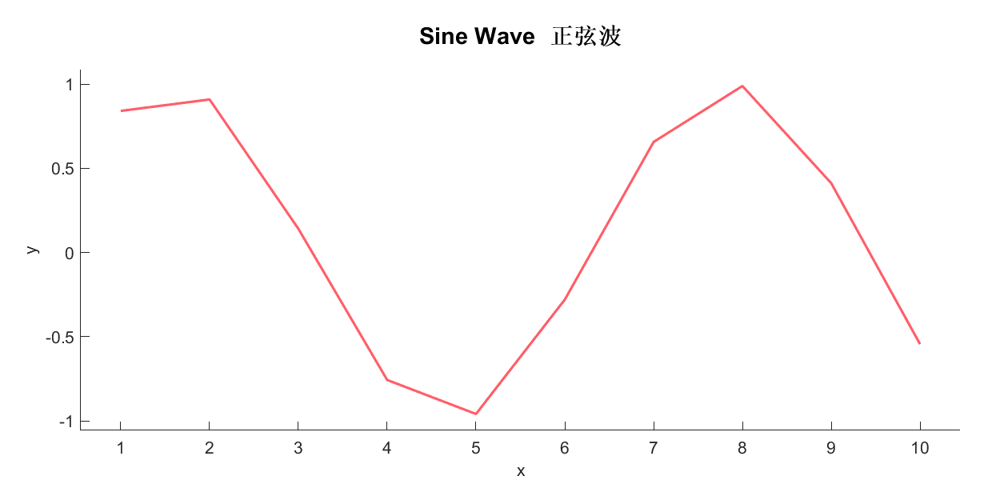
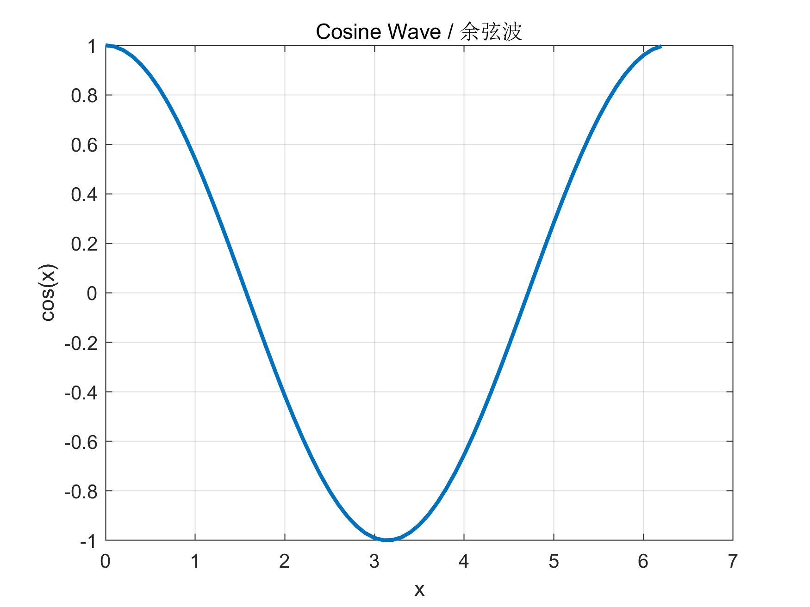

# 工程分析报告 / Engineering Analysis Report

**Author:** Xie Yu

**Date:** 2026-02-05

---

## 项目概述

### Project Overview

本报告演示了 MarkdownReport 类的基本功能。

This report demonstrates the basic functionality of the MarkdownReport class.
支持中文和英文混排。
Supports mixed Chinese and English text.

## 数据表 / Data Table

| Parameter | Value | Unit | 
| :--- | :--- | :--- | 
| 1.23 | 10 | 100 | 
| 4.56 | 20 | 200 | 
| 7.89 | 30 | 300 | 
**Table:** Test data table

## 参数表 / Parameters

| 参数 / Parameter | 值 / Value |
| :--- | :--- |
| Material | Steel |
| Thickness | 30 |
| Length | 1000 |
| Width | 500 |

## 自定义表 / Custom Table

| Name | Value | Unit | 
| :--- | :---: | ---: | 
| Test1 | 10.5 | mm | 
| Test2 | 20.3 | mm | 
| Test3 | 30.7 | mm | 
**Table:** Custom alignment table

## 列表 / Lists

- First item / 第一项
- Second item / 第二项
- Third item / 第三项

1. Step 1: Initialize / 步骤1：初始化
2. Step 2: Process / 步骤2：处理
3. Step 3: Output / 步骤3：输出

## 文本格式 / Text Formatting

**这是粗体文本 / This is bold text**

*这是斜体文本 / This is italic text*

`inline code`
## 代码块 / Code Block

```matlab
% This is a MATLAB code example
x = 1:10;
y = sin(x);
plot(x, y);
```

## 引用 / Quote

> 这是一个引用块 / This is a blockquote

## 图形 / Figures


**Figure 1:** 正弦波图 / Sine wave plot


**Figure 2:** 余弦波图 / Cosine wave plot

---
