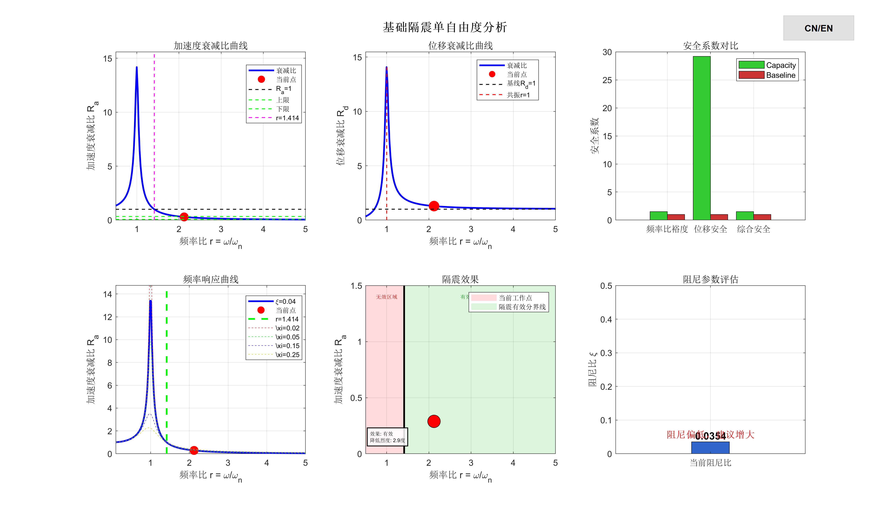

# MyIsolationProject analysis report

**Author:** Xie Yu

**Date:** 2026-02-06

---

## 项目概述

本报告采用单自由度（SDOF）模型对建筑隔震系统进行动态响应分析。模型适用于高度小于40m、剪切变形为主、上部结构刚度远大于隔震层的建筑结构。

---

## 单位系统

- 质量: ton (吨)
- 长度: mm (毫米)
- 压力/应力: MPa (兆帕)
- 加速度: m/s²
- 频率: rad/s

---

## 输入参数

| 参数名称 | 符号 | 数值 | 单位 | 
| :--- | :--- | :--- | :--- | 
| 上部结构总质量 | M | 1000 | ton | 
| 隔震层刚度 | K | 5e+04 | N/mm | 
| 隔震层阻尼系数 | C | 500 | N·s/mm | 
| 地面运动加速度 | a_g | 3 | m/s² | 
| 场地土特征频率 | ω | 15 | rad/s | 
| 建筑高度 | H | 2e+04 | mm | 
**Table:** 表 1: 输入参数

---

## 计算结果

| 参数名称 | 符号 | 数值 | 单位 | 
| :--- | :--- | :--- | :--- | 
| 自振频率 | ω_n | 7.071 | rad/s | 
| 阻尼比 | ξ | 0.03536 | - | 
| 频率比 | r | 2.121 | - | 
| 加速度衰减比 | R_a | 0.2886 | - | 
| 位移衰减比 | R_d | 1.285 | - | 
| 最大位移反应 | D_s | 17.13 | mm | 
| 隔震效果 | - | 有效 | - | 
| 地震烈度降低 | - | 2.883 | 度 | 
**Table:** 表 2: 计算结果

---

## 隔震效果评估

**隔震效果: 有效** (频率比 r = 2.121 ≥ 1.414)

预计降低地震烈度: **2.9 度**

---

## 安全校核结果

| 安全系数项 | 当前值 | 基准值 | 状态 | 
| :--- | :--- | :--- | :--- | 
| 频率比安全裕度 | 1.500 | 1.000 | 1 | 
| 位移安全系数 | 29.193 | 1.000 | 1 | 
| 综合安全系数 | 1.500 | 1.000 | 1 | 
**Table:** 表 3: 安全系数

- 加速度衰减比符合性: 满足 (R_a = 0.2886, 范围: [0.06, 0.33])

- 共振风险检查: 无共振风险

- 综合安全判断: 满足

---

## 可视化分析

以下图表展示了隔震系统的各项性能指标:

**Figure 1:** 综合分析图：包含加速度衰减比曲线、位移衰减比曲线、安全系数对比、频率响应曲线、隔震效果可视化和阻尼参数评估

---

## 计算方法说明

### 自振频率计算

自振频率公式: ω_n = sqrt(K/M)
其中 K 为隔震层刚度，M 为上部结构质量。需要将 K 从 N/mm 转换为 N/m，M 从 ton 转换为 kg 进行计算。

### 阻尼比计算

阻尼比公式: ξ = C / (2·M·ω_n)
其中 C 为隔震层阻尼系数，需要从 N·s/mm 转换为 N·s/m。

### 频率比计算

频率比公式: r = ω / ω_n
其中 ω 为场地土特征频率，ω_n 为隔震系统自振频率。

### 加速度响应计算

采用频域分析方法，计算频率响应函数:
H(ω) = sqrt((1 + (2ξr)²) / ((1 - r²)² + (2ξr)²))
加速度衰减比 R_a = H(ω)，即上部结构与地面的加速度比值。

### 位移响应计算

地面运动位移: D_g = |a_g| / ω²
最大位移反应: D_s = D_g · r² / sqrt((1 - r²)² + (2ξr)²)
其中 a_g 为地面运动加速度，最终位移结果以 mm 为单位。

---

## 适用条件

- 建筑高度: H < 40m (40000mm)
- 结构类型: 剪切变形为主
- 刚度关系: 上部结构刚度远大于隔震层刚度
- 模型类型: 单自由度（SDOF）模型适用

---

## 参考文献

- 结构隔震技术和应用

---

## 版本信息

**作者:** Xie Yu

**创建日期:** 2026-02-03

**报告生成日期:** 2026-02-06

---
